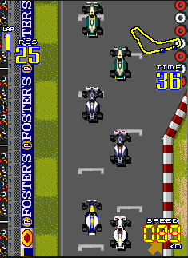

Multithreaded Grand Prix Simulator (multi-node)
===============================================

Implement a multithreaded grand prix simulator where every car will be an independent entity. You will be simulating an N laps race. This will be able to run in a multi-node setup.

Multi-node architecture
-----------------------
Your Grand Prix simulator should be able to run on top of `n` number of machines, it's your choice the way you implement it, but it looks a good candidate for a master-server and worker-client(s). Once a race is configured in the server, it will wait a pre-defined time  for the clients to join the race. The clients can be configurable, human or computer based ones. Remember, you are free to design and implement, just make sure it works in a multi-node architecture.

Technical Requirements
----------------------
- The race's lap can be static or automatically generated.
- Racers number can be configured on start.
- Define a random max speed for each car.
- You will emulate the increasing speed behaviour that any car has.
- If a car detect another car on his route and it's slower, it must slow down its speed or try to rebase it.
- Each racer behaviour will be implemented as a separated thread.
- Cars threads must use the same map or city layout data structure resource.
- Define how many laps before starting the race.
- Display each car's speed, position, racing time and lap.
- At the end, display the top 3 winners.

General Requirements
--------------------
- Make sure that you complete the below defined deliverables.
- Source code dependencies must be clearly documented.

Deliverables
------------
- Source code can be in a single student's account and the other team members can contribute to the same repository.
- Architecture Document - [ARCHITECTURE.md](ARCHITECTURE.md)
  - Details on how you designed and implemented your solution
  - Project architecture description, diagrams, charts and everything related to the way you think/design/build your program
- Build/Run automation (`Makefile` and documentation - [GRAND-PRIX.md](GRAND-PRIX.md))
  - Instructions on how to build and run your program
- Project's presentation (5-10 minutes)
  - A video presentation that will be delivered to the professor, in youtube preferable

Permitted programming languages
-------------------------------
- Multithreaded core backend
  - C
  - Go
- User Interface (optional)
  - Any
  - If it's terminal, output must be human-readable

Grading Policy
--------------
| Concept                      | Grade |
|------------------------------|-------|
| Architecture Document        | 20%   |
| Multithreaded implementation | 30%   |
| Build Automation             | 20%   |
| Coding best practices        | 10%   |
| Presentation                 | 20%   |
| TOTAL                        | 100%  |

- **Free Lab Bonus**

  You can get an extra bonus if you implement an intelligent mechanism to avoid being overrun when a racer tries to pass another racer. It must be documented in the `ARCHITECTURE.md` file.